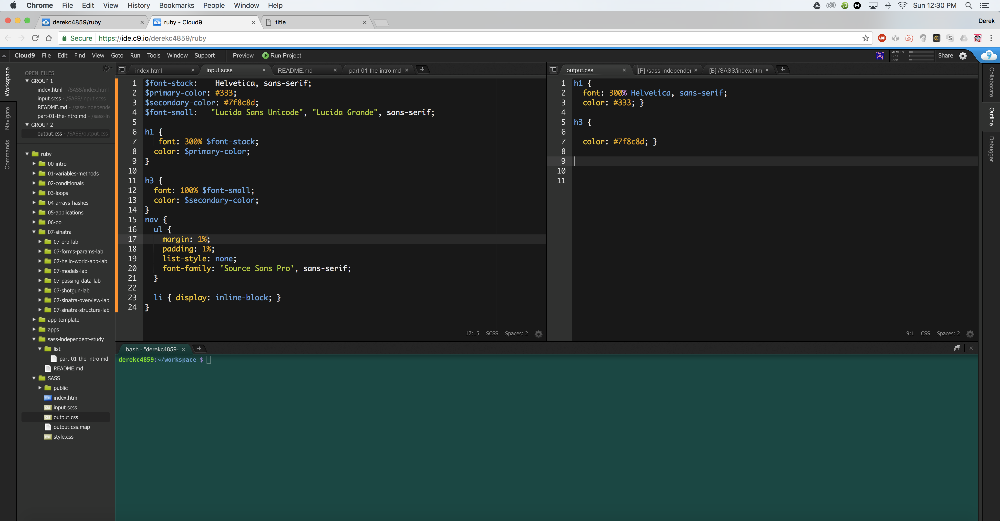

## Part 6: Current Project, OO in SASS, Functions

### What I am currently building

As of recently, I have being building an app where the user inputs what color they want and depending
on the color, the text color changes. I am trying to find a way to take the user's input and use it to change
the color of the background. The more I tinker around with making my app, the more I learn about SASS and its usefulness.
In addition, I want to make sure that my SASS code looks presentable so that people who are unfamilar about SASS. For now I have some
CSS buttons made from SCSS as my building blocks for my project.



## Functions

### Discovering Familiar Functions in SASS

While I have been starting to create my app, I found out that there are functions that work similarly to Ruby functions. This benefited
me greatly since my project would require numerous amounts of code. Luckily with functions, I can use conditionals to make sure
that my app works properly. 

### How functions Work in SASS

When making a function in your SCSS file, you need to define the name and what it's placeholder variable name is. Example:`@function set-notification-text-color($color)` 
Then you set the conditionals and what you want the function to do when your code meets the function's if statement or not. Note: If and else should look like this, `@if` and `@else`.
When your SCSS file gets transferred over to a CSS file, your function will not show up since CSS does not recognize what a function is.

Function example:

SCSS
``` SCSS
@function set-notification-text-color($color) { //name of function, what variable it grabs, $color = placeholder name
  @if (lightness($color) > 50) {
    @return #000000; // If background color is light, return dark to $color
  } @else {
    @return #ffffff; // Else, return light color to $color
  }
}

```

