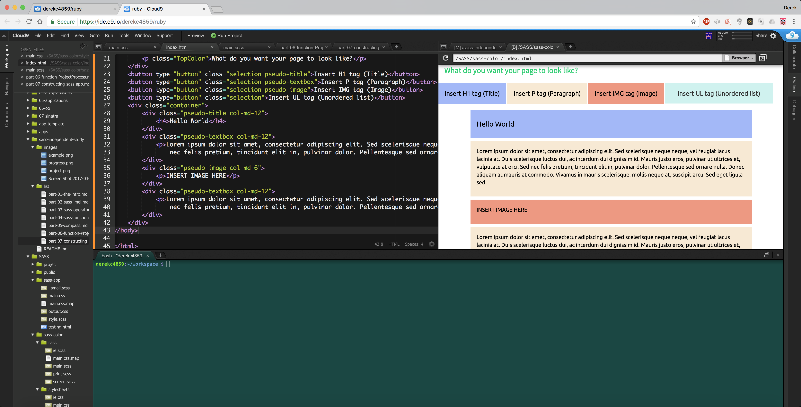

## Part 7: Constructing SASS App

### My SASS application idea

My idea of a SASS application is making a website that constructs a webpage layout template.
This will benefit people who are unfamilar with HTML and CSS since it will give them a visual representation of what everything does in their webpage/website
and how you want it to function. All of the HTML tags shown in the template will be color-coded, including the buttons that  add the HTML tags in the page template.

### Internal Questions

#### How would I apply SASS to my app?

I will use SASS to help create the visualizations of my page template application such as the text and the color for specific tags. Additionally, SASS will help me organize my app
so that every element of my page has the proper CSS attributes from SASS. 

#### Is my idea of an app possible to create?

As of now, I am trying to make my app idea into a reality. However, I am aware that there would be roadblocks up ahead in the future.  