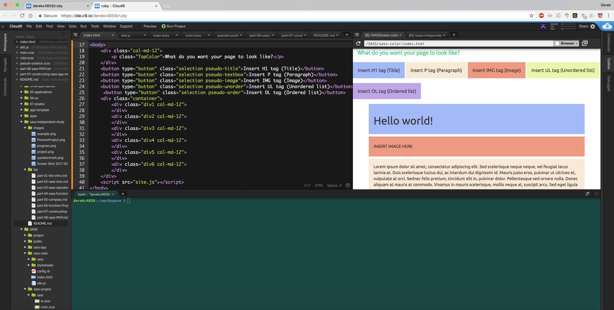

## Part 8: SASS MVP

### My SASS MVP (Most Viable Product)

Throughout this week, I have finally completed my SASS MVP. Thanks to learning jQuery, I was able to make my website functional and without 
any noticable bugs. Though, I noticed that my website is limited at the moment as the maximum amount of tags that can be displayed on my website is six.
I will attempt to get rid of my website's limitation by using jQuery to create an infinite amount of `<div>` tags. Additionally, I curious as to whether or not
I can implement div classes on my website



### Finding the Solution

At first, I had no clue how to make my website work properly. I had all of the main components that made up my website, but I wanted to create an MVP. 
I did some Google searching and I found out that JQuery can add HTML tags and CSS classes in my website. So I relearned JQuery in a day and know how to create functions to do
important tasks.
```JS
var num = 1;
$(".pseudo-title").click(function() {
    $(".div" + num).addClass("pseudo-title box");
    $(".div" + num).html("<h1>Hello world!</h1>");
    num = num + 1;
});
$(".pseudo-textbox").click(function() {
    $(".div" + num).addClass("pseudo-textbox box");
    $(".div" + num).html(" <p>Lorem ipsum dolor sit amet, consectetur adipiscing elit. Sed scelerisque neque neque, vel feugiat lacus lacinia at. Duis scelerisque luctus dui, ac interdum dui dignissim id. Mauris justo eros, pulvinar ut ultrices et, vulputate at orci. Sednec felis pretium, tincidunt elit in, pulvinar dolor. Pellentesque sed ornare nulla. Donec aliquam at mauris at commodo. Vivamus in mauris scelerisque, mollis neque at, suscipit arcu. Sed eget ligula sed.</p>");
    num = num + 1;
});
$(".pseudo-image").click(function() {
    $(".div" + num).addClass("pseudo-image box");
    $(".div" + num).html("<h5>INSERT IMAGE HERE</h5>");
    num = num + 1;
});
$(".pseudo-unorder").click(function() {
    $(".div" + num).addClass("pseudo-unorder box");
    $(".div" + num).html("<ul><li>gdgffgdg</li><li>fwergerer</li><li>eyy6uur6u</li></ul>");
    num = num + 1;
});
$(".pseudo-order").click(function() {
    $(".div" + num).addClass("pseudo-order box");
    $(".div" + num).html("<ol><li>gdgffgdg</li><li>fwergerer</li><li>eyy6uur6u</li></ol>");
    num = num + 1;
});
```
For my webpage template website, I implemented jQuery functions to all of the HTML tag buttons so that when the user clicks on a button, the function will
generate the tag being displayed.

### Takeaways

#### Take some small steps when trying to make an MVP
While I wanted to do some more interesting things with my webpage template, my first priority is to have a website that works correctly 
and that meets the minimum requirements. If I made a website that is suppose to do many unique things but is not functional, it defeats the purpose of the website.
This is why I am careful when I am planning out a feature for my website and determine if it is necessary or not.